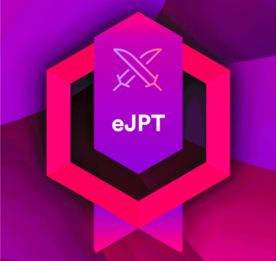
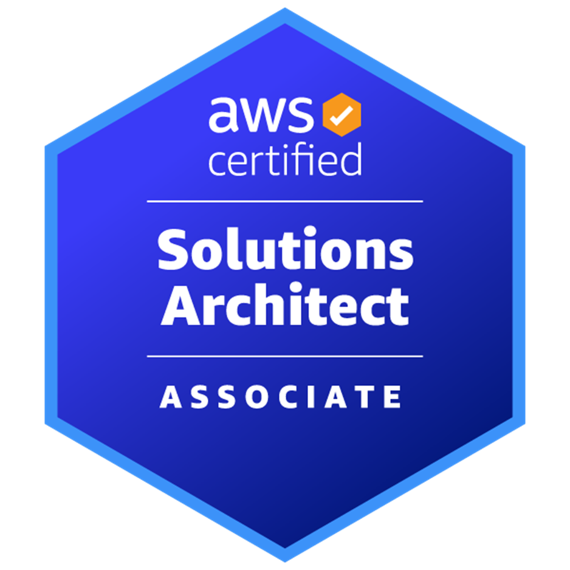
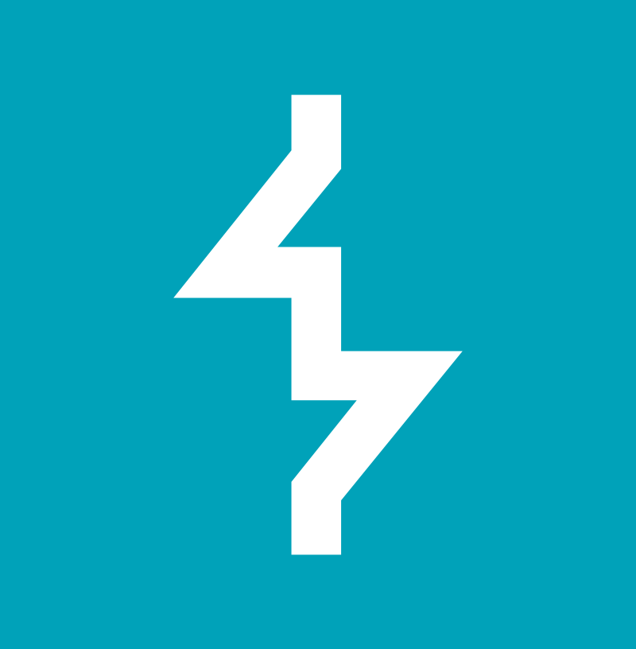
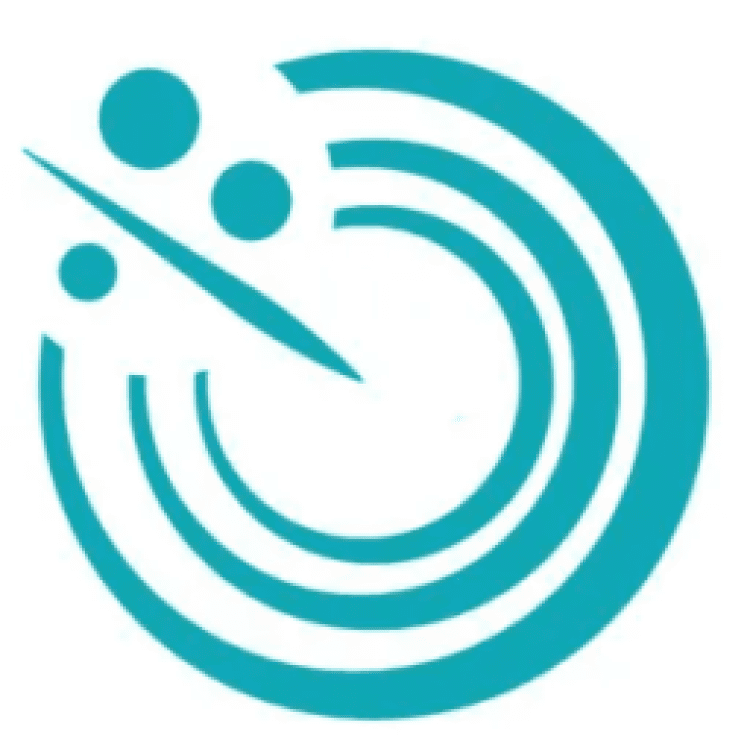
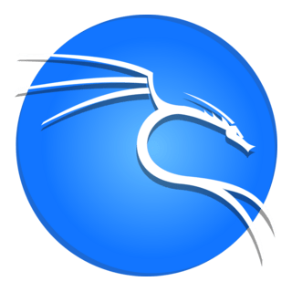
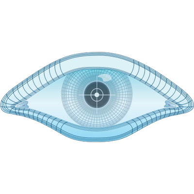
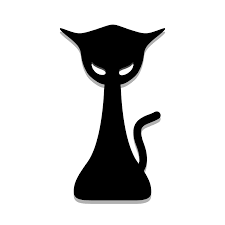
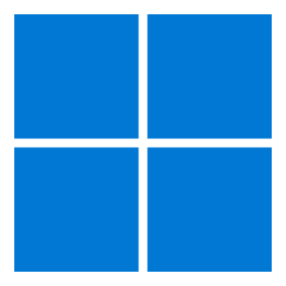
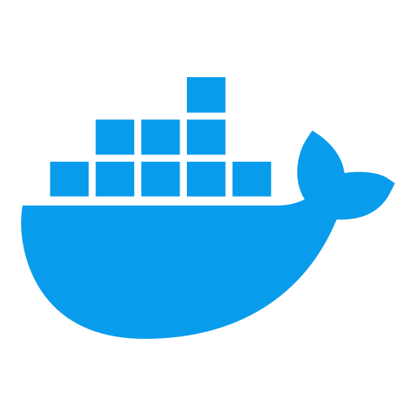
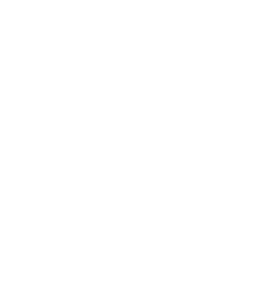

  

**Cloud Engineering Associate** at **Fidelity Investments** with experience managing AWS infrastructure. My core interests lie in **cloud administration, cybersecurity, and penetration testing**. I specialize in **Cloud Infrastructure Management**, **Automation**, and **Security Operations** — with hands-on experience in secure infrastructure deployment, vulnerability assessment, and incident investigation.

---

## 📜 Certifications

  <figure style="display:inline-flex; flex-direction:column; align-items:center; margin:0; width:120px;">
    
    <figcaption style="margin-top:10px; font-weight:600; font-size:14px; text-align:center;">eJPTv2</figcaption>
  </figure>
  <figure style="display:inline-flex; flex-direction:column; align-items:center; margin:0; width:120px;">
    
    <figcaption style="margin-top:10px; font-weight:600; font-size:14px; text-align:center;">PWPA</figcaption>
  </figure>
  <figure style="display:inline-flex; flex-direction:column; align-items:center; margin:0; width:120px;">
    
    <figcaption style="margin-top:10px; font-weight:600; font-size:14px; text-align:center;">AWS CSAA-003</figcaption>
  </figure>

---

## 🛠️ Technical Skills

* **Systems Engineering:** Linux/Windows Administration, AWS, Docker, Python, Ansible, Bash, Power Automate, VMware
* **Cloud Security:** AWS, Boto3, Jenkins, Datadog, DevSecOps
* **Programming & Scripting:** Python, Bash, PowerShell, Ansible
* **Penetration Testing:** Burp Suite, FFUF, Nessus, Nmap, Hashcat, Hydra, Metasploit, Wireshark, Kali Linux
* **Tools & Platforms:** GitHub, Docker, AWS, VMware
* **Security Assessment:** Vulnerability Analysis, Network Security, Application Testing

---

## 👨‍💻 Work Experience

* **Cloud Engineering Associate | Fidelity Investments** *(Present)*
  Cloud engineer supporting company applications and administrating infrastructure, governance, security, and financial operations.

* **Lead Web Penetration Tester | Liberty University Collegiate Penetration Testing Competition Team** *(Past)*
  Progressed from team member to lead penetration tester, specializing in web application security assessments and competitive cybersecurity events.

* **Datacenter Operations Intern | Fidelity Investments** *(Past)*
  Supported RTP Data Center Operations with automation, infrastructure management, and operational improvements.

* **Security Operations Intern | Fidelity Investments** *(Past)*
  Supported Vendor Security Operations team with third-party risk management.

---

## **👨‍💻 Tech Stack**  
### 🔍 Penetration Testing

  &nbsp;
  &nbsp;
  &nbsp;
  &nbsp;
  &nbsp;
  &nbsp;
  &nbsp;
  &nbsp;
  

### 💻 Systems Engineering

  &nbsp;
  &nbsp;
  &nbsp;
  &nbsp;
  &nbsp;
  &nbsp;
  &nbsp;
  &nbsp;
  

### ☁️ Cloud & DevOps

  &nbsp;
  &nbsp;
  &nbsp;
  &nbsp;
  

---

## 🌐 Connect With Me:

  &nbsp;&nbsp;
  &nbsp;&nbsp;
  

---

# 📊 GitHub Stats:

  <!-- 💠 Profile Details Card -->
  

  <!-- 🧾 Extra GitHub Stats -->
  

  <!-- 🧬 Top Languages (Pie) [Responsive] -->

---

### Contribution Graph with Snake 🐍
<picture>
  <source media="(prefers-color-scheme: dark)" srcset="https://raw.githubusercontent.com/bcchappell945/bcchappell945/output/github-snake-dark.svg" />
  <source media="(prefers-color-scheme: light)" srcset="https://raw.githubusercontent.com/bcchappell945/bcchappell945/output/github-snake.svg" />
  
</picture>

---

## 🏆 GitHub Trophies
  

---